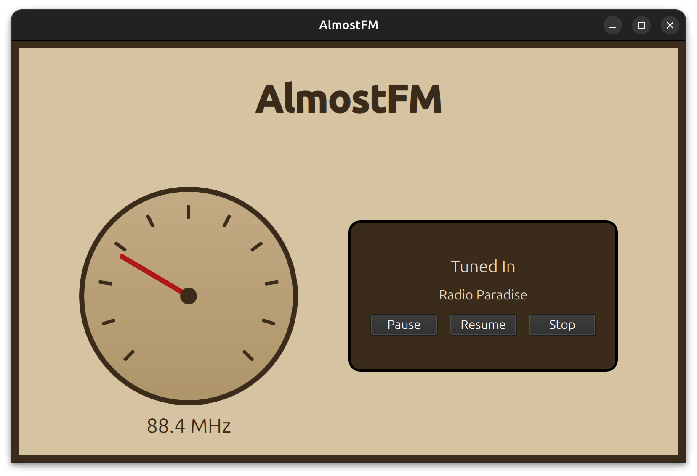

# AlmostFM — An Internet Radio Player


*A hands-on dive into C++, DSP fundamentals, audio pipelines, and Qt/QML UI design.*

## Overview

AlmostFM is a custom-built, cross-platform internet radio streaming application developed using **modern C++**, **Qt 6**, **QML**, and a real digital audio pipeline built around **libcurl**, **mpg123**, and **PortAudio**.

This project was created as a practical exploration of **how audio actually travels from a remote stream → into your system → and out of your speakers**, while learning the workflows behind Linux development, GUI engineering, CMake, and cross-platform deployment.

The app streams MP3 radio stations in real time, decodes audio using mpg123, and pushes raw PCM audio to PortAudio — all wrapped in a clean, declarative QML UI.

---

## Learning Objectives

### C++ & Build Systems
- Modern C++17 development
- CMake configuration
- Cross-platform linking with external libraries

### Digital Audio Fundamentals
- MP3 streaming and decoding
- PCM buffers and sampling
- Real-time audio pipeline management

### Qt & QML
- Declarative UI design
- Integrating C++ backend with QML frontend
- Signals/slots, properties, threading

### Linux & DevOps Workflow (WIP)
- pkg-config, toolchains
- GitHub CI/CD
- AppImage packaging

---

## Features

### Audio Streaming Pipeline
- Real-time streaming of MP3 internet radio
- MP3 decoding via **mpg123**
- Low-latency playback using **PortAudio**

### Networking
- HTTP stream handling via **libcurl**

### User Interface
- Clean QML interface
- Play / Pause / Stop controls
- Station switching

### Station List

The application currently includes the following preset stations:

| Station Name            | Frequency (MHz) | Stream URL |
|-------------------------|-----------------|------------|
| Radio Paradise          | 88.5 MHz        | http://stream.radioparadise.com/mp3-192 |
| Soma FM Groove Salad    | 92.8 MHz        | http://ice1.somafm.com/groovesalad-128-mp3 |
| Swiss Jazz              | 95.2 MHz        | http://stream.srg-ssr.ch/m/rsj/mp3_128 |
| KEXP Seattle            | 101.7 MHz       | http://live-mp3-128.kexp.org/kexp128.mp3 |
| Jazz24                  | 106.5 MHz       | http://live.wostreaming.net/direct/ppm-jazz24aac-ibc1 |
---

## Technical Details

### Frameworks & Libraries
- Qt 6.8+
- libcurl
- mpg123
- PortAudio
- C++17
- CMake

### Code Structure
- `radiostatus.h/.cpp` — core streaming logic
- `Main.qml` — UI layout
- `main.cpp` — app bootstrap

---

## Installation

## Build from Source

### Prerequisites (Ubuntu)
```bash
sudo apt install build-essential cmake pkg-config
sudo apt install qt6-base-dev qt6-declarative-dev
sudo apt install libcurl4-openssl-dev libmpg123-dev portaudio19-dev
```

### Build
```bash
git clone https://github.com/ogetalha/almostfm.git
cd almostfm
mkdir build && cd build
cmake ..
cmake --build . --config Release
```

---

## How It Works

```
Internet Stream 
   ↓ (libcurl)
MP3 Data  
   ↓ (mpg123)
Decoded PCM Audio  
   ↓ (PortAudio)
System Output → Speakers
```

---

## What's Missing?

- Volume control  
- Favorites list  
- Better buffering  
- Visualizer (FFT)  
- Error handling improvements  
- UI redesign with animations  

---

## License

MIT License — see LICENSE.
